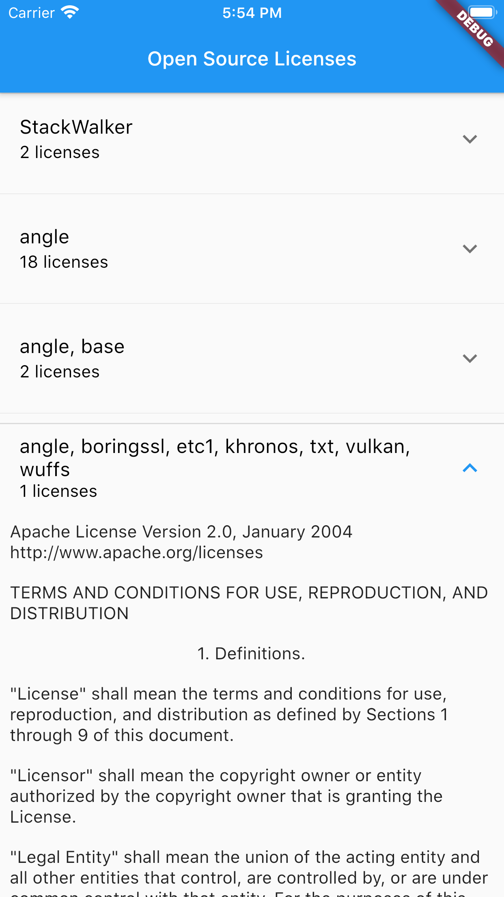

# custom_license_page

This is an example of how to implement custom open source license page for flutter.

## Motivation

The default `showLicensePage` follow the default Material Theme and some decoration. This doesn't suits some of my application needs, and the time i wrote this in flutter 1.17.X, the license page doesn't group same license and this causing the resulting page to be very long.

## Getting Started

Instead of opening each license in separate page this example combine put it all in the same 
page hidden inside ExpansionTile, each license then can be shown by expanding the ExpansionTile.

Customized the screen as you need and recommended to do so to match your application.
